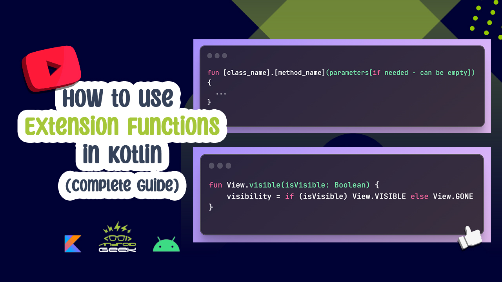

# Extension-Functions-Youtube

</a>

 
YouTube Video 
  

  
  
Article on Medium:
 
https://medium.com/@ezatpanah/how-to-use-extension-functions-in-kotlin-4b5e52e84ee5

 
 

✨ Join Medium to read thousands of valuable stories ✨
 
https://medium.com/@ezatpanah/membership
